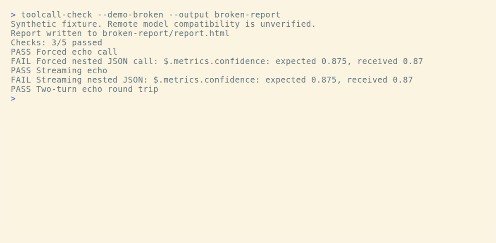
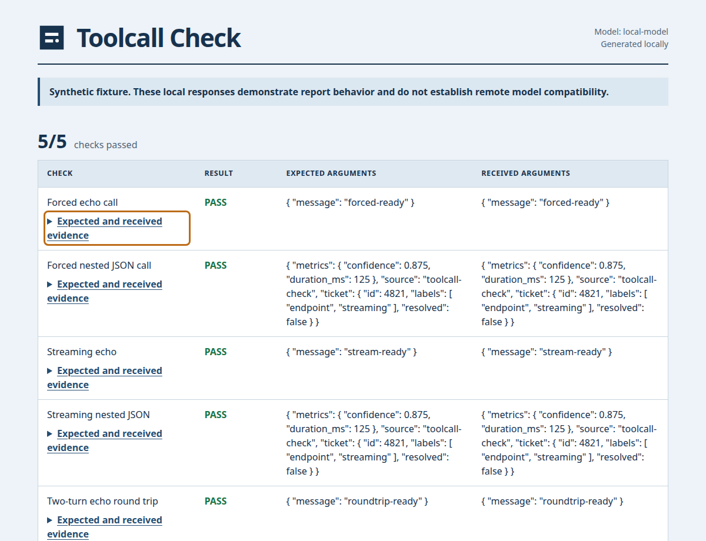

<h1 align="center">
  <br>
  ToolCallCheck
</h1>

<p align="center">
  <strong>Check exact tool arguments, streamed calls, and the return trip through a local tool result.</strong>
</p>

<p align="center">
  <a href="https://github.com/Arthur031221/ToolCallCheck/stargazers"></a>
  <a href="https://github.com/Arthur031221/ToolCallCheck/actions"></a>
  <a href="LICENSE"></a>
</p>

<p align="center">
  <a href="#quickstart">Quickstart</a> |
  <a href="#how-it-works">How it works</a> |
  <a href="#examples">Examples</a> |
  <a href="#faq">FAQ</a>
</p>

> [!TIP]
> Try the local synthetic fixture without configuring an endpoint:
> ```sh
> uvx --from git+https://github.com/Arthur031221/ToolCallCheck ToolCallCheck --demo
> ```

<p align="center">
  
</p>

## Why ToolCallCheck

A successful HTTP response does not show whether nested arguments kept their JSON types, whether a streamed call survived fragment boundaries, or whether the assistant can use a tool result on its next turn. When one of those steps goes wrong, the response body alone can be difficult to inspect.

This command sends five small probes and saves a private HTML report with sanitized request and response traces. It does not run generated tools. The local demo uses a synthetic fixture and says so in its output. A failed forced-call probe describes that case, and does not establish whether automatic tool selection works.

## Features

- **Checks nested values:** compares exact keys, arrays, strings, numbers, and booleans.
- **Rebuilds streamed calls:** joins fragmented UTF-8 SSE events by choice and call index.
- **Checks the next turn:** returns a fixed local result and requires an exact normal assistant answer.
- **Keeps failure evidence:** each probe records expected values, received values, and its bounded trace.
- **Limits requests:** rejects redirects and bounds response bytes and overall request time.
- **Writes private reports:** creates a new directory with restrictive permissions and escapes HTML evidence.

## Quickstart

The hero command requires [uv](https://docs.astral.sh/uv/getting-started/installation/). For a persistent command, install from GitHub:

```sh
uv tool install git+https://github.com/Arthur031221/ToolCallCheck
```

Try the synthetic fixture in one command:

```sh
uvx \
  --from git+https://github.com/Arthur031221/ToolCallCheck \
  toolcall-check \
  --demo \
  --output fixture-report
```

For a local endpoint, set a key only when the endpoint requires one:

```sh
export TOOLCALL_CHECK_API_KEY="your-local-endpoint-key"
toolcall-check --base-url http://127.0.0.1:1234/v1 --model local-model --output endpoint-report
```

The command exits `0` when all checks pass, `1` when one or more checks fail, and `2` for invalid configuration or report-write errors. It refuses to reuse an output path.

## Examples

A successful synthetic run prints a report path followed by the check count:

```text
Checks: 5/5 passed
PASS Forced echo call
PASS Forced nested JSON call
PASS Streaming echo
PASS Streaming nested JSON
PASS Two-turn echo round trip
```

Show two intentional argument mismatches and inspect their evidence:

```sh
toolcall-check --demo-broken --output broken-report
```

This command exits `1`. Its report is labeled synthetic and is not evidence of a remote model's compatibility.

## How it works

The checks force one named function at a time, then reconstruct streamed deltas before comparing arguments. The final check replays the validated assistant call with a locally generated result and asks for a normal assistant response containing that result exactly. A strict completion marker policy requires `finish_reason: tool_calls` and `[DONE]` for streams. The parser rejects duplicate JSON keys and non-finite numbers. Booleans, integers, and floats remain distinct during exact comparison.

Each single-call probe runs in a disposable Python process. The round-trip probe shares one process across its two exchanges. The parent enforces an overall wall-time limit and reaps a timed-out worker. HTTP redirects are rejected. Responses are capped at 256 KiB and requests at 64 KiB. Single-call probes have a 20 second wall limit, while the complete round trip has a 40 second limit. Socket operations use a 15 second timeout. The tool never invokes a generated function or command.

| Tool | What it checks | How this project is scoped |
| --- | --- | --- |
| [CompatCanary](https://github.com/CognizenOrg/compatcanary) | A broader chat API compatibility scan that documents forced calls, streaming, and structured output. | This project concentrates on nested argument integrity, reconstructing streamed tool fragments, a fixed second-turn result, and inspectable traces. |
| ToolCallCheck | Five forced, streaming, and round-trip probes with exact argument comparison. | The report keeps one result and trace for each named check. |

<details>
<summary><b>View a generated HTML report</b></summary>



</details>

## Details

<details>
<summary><b>Options and saved files</b></summary>

```text
toolcall-check --base-url URL [--model NAME] [--api-key-env VARIABLE] [--output DIRECTORY]
toolcall-check --demo [--output DIRECTORY]
toolcall-check --demo-broken [--output DIRECTORY]
```

The default key variable is `TOOLCALL_CHECK_API_KEY`. Use `--api-key-env` to select another variable. The key is sent as an authorization header. Saved strings and reconstructed stream fields mask the supplied key. Authorization headers are omitted from traces. Other credential fields and common token patterns are redacted recursively. Redaction is best effort, so inspect a report before sharing it. When joined stream fragments contain a detected secret, their trace fragments are masked and the sanitized assembled field is saved.

A new output directory contains `report.html`, `results.json`, and `trace.json`. The directory uses mode `0700` and each file uses mode `0600` on Unix-like systems. The HTML has no scripts, remote assets, or external requests.

</details>

<details>
<summary><b>Continuous integration</b></summary>

The workflow runs the standard-library test suite on Python 3.10 through 3.14. Install the project with `python -m pip install --editable .` and run `python -m unittest discover -s tests -v`.

</details>

<details>
<summary><b id="faq">FAQ</b></summary>

**Does the demo test a remote model?** No. It starts a local synthetic HTTP fixture and exercises the same HTTP client and report path.

**What does an empty or malformed call mean?** The relevant probe fails and keeps bounded response evidence in the report. The remaining checks still run.

**Can the report be shared as-is?** Review the HTML and both JSON files first. Secret redaction is best effort.

</details>

## Contributing

[Report a problem](https://github.com/Arthur031221/ToolCallCheck/issues) or send a focused pull request. See [CONTRIBUTING.md](CONTRIBUTING.md) for the test command and report-sharing guidance.

## License

MIT. See [LICENSE](LICENSE).

Assisted by Claude/Codex.
